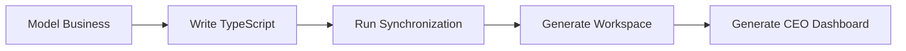
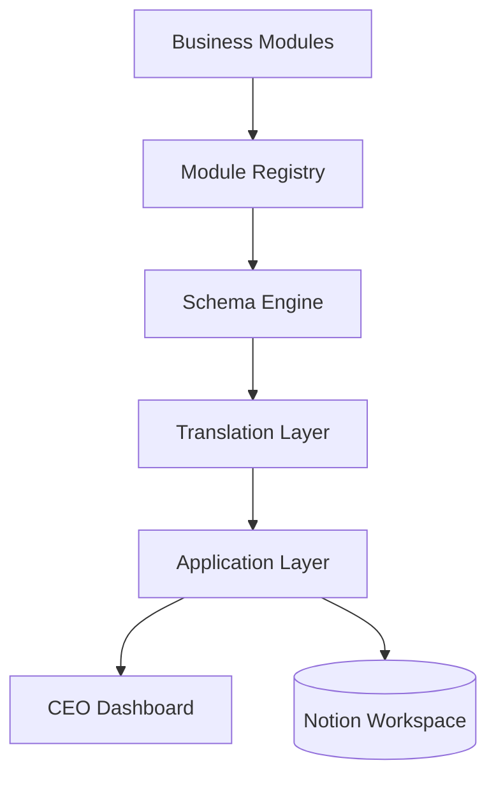

# AJ-OS

> **A code-first business operating system that transforms business data into actionable decisions.**


AJ-OS is an open-source TypeScript framework that generates and synchronizes a complete business workspace in Notion.

Instead of manually creating databases, properties and relationships, AJ-OS treats your workspace as infrastructure. Business capabilities are defined in code, validated through a strongly typed schema, synchronized automatically, and presented through an executive dashboard.

Originally built around the needs of a freelance game audio business, AJ-OS is designed as a reusable architecture that can support many different business domains.

---

# Why AJ-OS?

Traditional productivity systems begin by manually configuring a workspace.

AJ-OS reverses that workflow.

Business logic is modeled in TypeScript and the workspace is generated automatically.



The result is a reproducible, version-controlled business operating system.

---

# Features

### Code-First Business Modeling

- Business modules defined in TypeScript
- Strongly typed schema definitions
- Version-controlled business infrastructure
- Documentation-driven architecture

### Workspace Synchronization

- Idempotent database creation
- Automatic relation synchronization
- Safe repeated synchronization
- Deterministic execution

### Executive Dashboard

- Automatically generated CEO Dashboard
- Business Health overview
- Executive summaries
- Priority generation
- Action recommendations

### Business Modules

Current modules include:

- Projects
- CRM
- Portfolio
- Production Music
- Finance
- Game Jams

Every module is independent, strongly typed and automatically synchronized.

---

# Screenshots

> Screenshots will be added for the v1.0 release.

Recommended screenshots:

- CEO Dashboard
- Complete Workspace
- Projects
- CRM
- Production Music
- Finance

---

# Quick Start

## Requirements

- Node.js 22+
- npm
- Notion account
- Notion Integration

Clone the repository:

```bash
git clone https://github.com/aj-kivimaki/aj-os.git

cd aj-os

npm install
```

Create a `.env` file:

```env
NOTION_API_KEY=your_notion_api_key
NOTION_PARENT_PAGE_ID=your_parent_page_id
```

Synchronize your workspace:

```bash
npm run sync
```

AJ-OS will automatically:

- Discover existing databases
- Create missing databases
- Synchronize relations
- Generate the CEO Dashboard

---

# Example Output

```text
Workspace Synchronization

Discover existing databases

Create missing databases

Collect database IDs

Resolve relations

Generate CEO Dashboard

Summary

Created: 0
Skipped: 6
Relations skipped: 5
Dashboard generated: 1
```

Synchronization is fully idempotent.

Running the command multiple times never creates duplicate databases or relations.

---

# Documentation

The documentation is organized into focused sections.

| Documentation        | Purpose                                            |
| -------------------- | -------------------------------------------------- |
| `docs/guides/`       | Installation, configuration and development guides |
| `docs/architecture/` | System architecture and design decisions           |
| `docs/modules/`      | Business module documentation                      |
| `ROADMAP.md`         | Future direction                                   |
| `CHANGELOG.md`       | Release history                                    |
| `CONTRIBUTING.md`    | Contribution guidelines                            |

---

# Architecture

AJ-OS follows a layered architecture.



Business logic remains independent from infrastructure.

For a complete architectural overview, see:

- `docs/architecture/`

---

# Contributing

Contributions, discussions and architectural feedback are welcome.

Before contributing, please read:

- `CONTRIBUTING.md`
- `docs/guides/development.md`

---

# License

Released under the MIT License.

See the `LICENSE` file for details.

---

> **Model your business. Version your workflow. Synchronize your workspace.**
