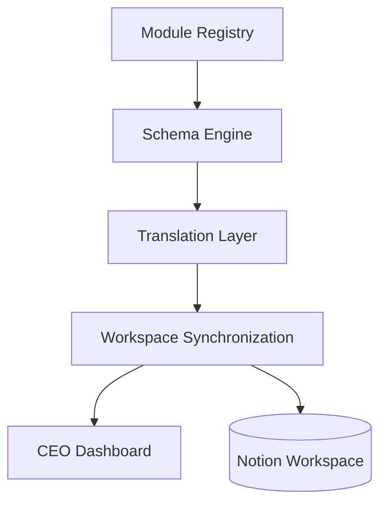
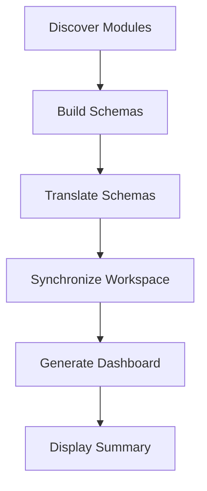
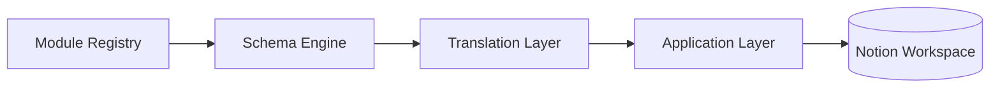

# Application Layer

## Overview

The Application Layer is the orchestration layer of AJ-OS.

It coordinates the complete synchronization process by bringing together business modules, schema definitions, translation services and backend integrations.

Unlike lower architectural layers, the Application Layer contains workflows rather than business definitions.

Its responsibility is to execute the business operating system.

---

# Execution Flow

The following diagram illustrates the overall execution flow.



The Application Layer coordinates every step while keeping each architectural layer independent.

---

# Responsibilities

The Application Layer is responsible for:

- Coordinating synchronization
- Executing application workflows
- Calling infrastructure services
- Managing execution order
- Reporting synchronization results

It is intentionally **not** responsible for:

- Business modeling
- Schema definitions
- Property translation
- Business Rules

Those responsibilities belong to dedicated architectural layers.

---

# Why an Application Layer?

Without an orchestration layer, individual components would need to communicate directly with one another.

This would increase coupling and make the system more difficult to maintain.

Instead, the Application Layer acts as the coordinator.

```text
Business Modules

↓

Schema Engine

↓

Translation Layer

↓

Application Layer

↓

Notion Workspace
```

Every layer performs its own task before handing control to the next.

---

# Synchronization Workflow

A typical synchronization follows these stages.



Each stage completes before the next begins.

This predictable execution order simplifies testing, debugging and future extension.

---

# Error Handling

The Application Layer coordinates error handling during synchronization.

Typical responsibilities include:

- Reporting failures
- Preventing partial execution where possible
- Preserving completed work
- Producing clear execution summaries

Errors should be communicated without leaving the workspace in an inconsistent state.

---

# Design Principles

## Orchestration

The Application Layer coordinates work.

It does not implement business logic.

---

## Deterministic Execution

Every synchronization follows the same execution order.

Given the same input, AJ-OS should always produce the same result.

---

## Separation of Concerns

Each architectural layer performs one responsibility.

The Application Layer combines those responsibilities into a complete workflow without taking ownership of them.

---

## Extensibility

New workflows should be introduced by composing existing services rather than modifying lower architectural layers.

This keeps the architecture flexible as new capabilities are added.

---

# Relationship to Other Layers

The Application Layer connects the architectural pipeline with the execution environment.



It is the final architectural layer before synchronization reaches the backend.

---

# Future Opportunities

The Application Layer provides a natural location for higher-level workflows.

Potential future capabilities include:

- Scheduled synchronization
- Morning Brief generation
- Notification services
- Automated reporting
- Workflow automation
- Multiple synchronization targets

These features extend orchestration without affecting the business model.

---

# Summary

The Application Layer is the execution engine of AJ-OS.

It coordinates the architectural layers into a single, deterministic synchronization workflow while preserving the independence of each component.

By separating orchestration from business logic, AJ-OS remains easier to understand, extend and maintain as the project grows.
