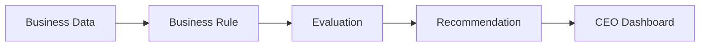
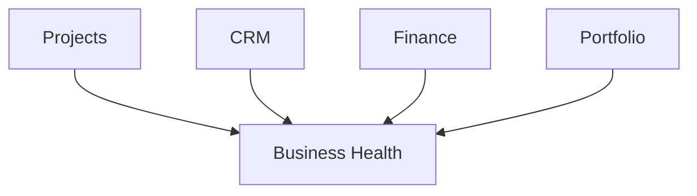
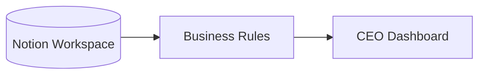

# Business Rules

## Overview

Business Rules transform business data into actionable insights.

While Business Modules describe the structure of the business, Business Rules interpret that information and determine what deserves attention.

Business Rules never modify business data.

Their responsibility is to evaluate the current state of the business and produce recommendations that support decision-making.

---

# Rule Evaluation Flow

The following diagram illustrates how Business Rules are evaluated.



Business data remains unchanged throughout the process.

Only insights and recommendations are produced.

---

# Responsibilities

Business Rules are responsible for:

- Evaluating business data
- Identifying priorities
- Detecting overdue work
- Calculating Business Health
- Producing recommendations
- Supplying executive insights to the CEO Dashboard

Business Rules never create, modify or synchronize business data.

---

# Why Business Rules?

Raw business data answers questions such as:

- How many projects exist?
- How many contacts are in the CRM?
- Which invoices are unpaid?

Business Rules answer more valuable questions:

- Which project requires attention today?
- Which client needs a follow-up?
- Is the business financially healthy?
- What should I focus on next?

This distinction transforms information into decision support.

---

# Example Rule

A Business Rule evaluates a specific business condition.

Example:

```text
IF

Project Status = Active

AND

Target Date < Today

THEN

Create Recommendation:

"Review overdue project."
```

The rule does not modify the project.

It simply identifies that attention is required.

---

# Business Health

Multiple Business Rules contribute to an overall Business Health assessment.

For example:



The resulting evaluation provides a high-level summary of the current business state.

---

# Design Principles

## Read-Only

Business Rules never modify business data.

They observe and evaluate.

---

## Independent

Each rule evaluates one business concern.

Rules remain small, focused and independently testable.

---

## Composable

Multiple rules can contribute to a single dashboard widget or executive summary.

No rule depends on another rule.

---

## Explainable

Every recommendation should be understandable.

Users should always be able to identify which rule produced an insight.

---

# Relationship to Other Layers

Business Rules operate after synchronization has completed.



Synchronization creates the business data.

Business Rules interpret it.

The CEO Dashboard presents the results.

---

# Future Opportunities

The Business Rules framework enables increasingly sophisticated decision support.

Potential future capabilities include:

- Priority scoring
- Risk assessment
- Productivity analysis
- Revenue forecasting
- Goal tracking
- Opportunity detection
- Habit monitoring
- AI-assisted recommendations

Each new capability can be introduced as an independent rule without affecting existing business logic.

---

# Summary

Business Rules are the intelligence layer of AJ-OS.

They transform synchronized business data into meaningful recommendations without modifying the underlying information.

By separating business evaluation from business storage, AJ-OS remains transparent, maintainable and extensible while helping users focus on the work that matters most.
