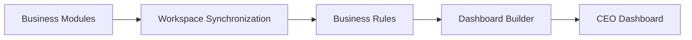
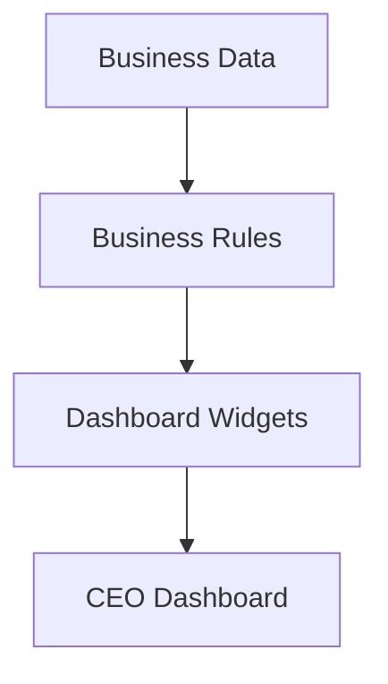
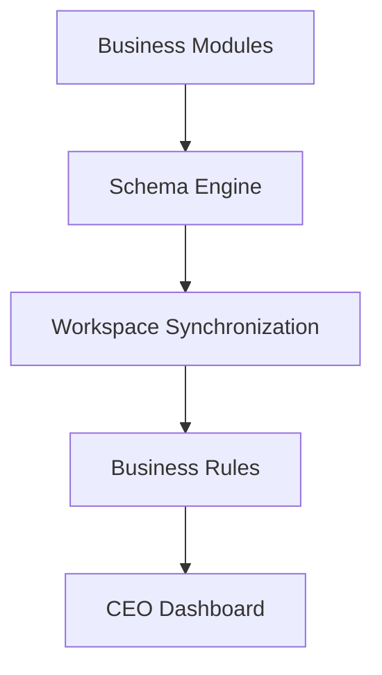

# CEO Dashboard

## Overview

The CEO Dashboard is the primary user interface of AJ-OS.

Rather than presenting raw databases, it provides an executive summary of the current business state.

The dashboard aggregates information from every business module, applies Business Rules and presents the most important information in a single view.

Its purpose is to answer one question:

> **What should I focus on today?**

---

# Dashboard Generation

The following diagram illustrates how the dashboard is generated.

The dashboard is generated from business data.

It never becomes the source of truth.

---

# Responsibilities

The CEO Dashboard is responsible for:

- Summarizing business activity
- Highlighting priorities
- Displaying Business Health
- Presenting recommendations
- Linking to business modules
- Providing an executive overview

It intentionally avoids replacing detailed database views.

---

# Why a Dashboard?

Individual databases answer detailed operational questions.

For example:

- Which projects are active?
- Which invoices are unpaid?
- Which contacts require follow-up?

The dashboard answers higher-level questions.

For example:

- Is the business healthy?
- What needs attention today?
- Where should I focus next?
- Which areas require action?

This distinction allows users to understand the overall state of the business at a glance.

---

# Dashboard Components

The dashboard is composed of independent widgets.

Examples include:

- Business Health
- Active Projects
- Upcoming Deadlines
- Follow-ups
- Financial Overview
- Recent Activity
- Recommendations

Each widget summarizes a specific aspect of the business.

---

# Dashboard Flow

Business Rules interpret business information.

Dashboard Widgets present those insights in a concise, actionable format.

---

# Design Principles

## Executive First

The dashboard prioritizes information that supports decision-making.

It summarizes rather than replaces detailed business data.

---

## Read-Only

The dashboard does not modify business information.

Its purpose is to communicate insights.

---

## Action-Oriented

Every widget should help answer:

> **What should I do next?**

Information without action has limited value.

---

## Focused

Only the most important information should appear.

A concise overview is more valuable than a complete data dump.

---

# Relationship to Other Layers

The dashboard sits at the top of the AJ-OS architecture.

Every architectural layer contributes to the final executive view.

---

# Future Opportunities

The dashboard is designed to evolve alongside the business.

Potential future enhancements include:

- Morning Brief
- Weekly summaries
- Goal tracking
- Trend analysis
- Financial forecasting
- AI-assisted recommendations
- Custom widgets
- Multiple dashboard layouts

These capabilities extend the dashboard without changing the underlying architecture.

---

# Summary

The CEO Dashboard is the primary experience of AJ-OS.

It transforms synchronized business data into a clear executive overview, helping users understand the current state of their business and identify where to focus next.

By combining Business Modules, Workspace Synchronization and Business Rules, the dashboard becomes the central decision-support interface of the Business Operating System.
