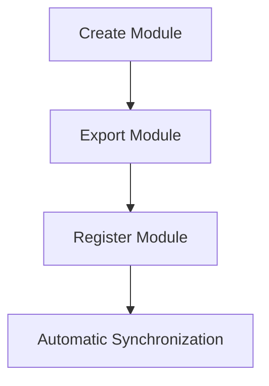
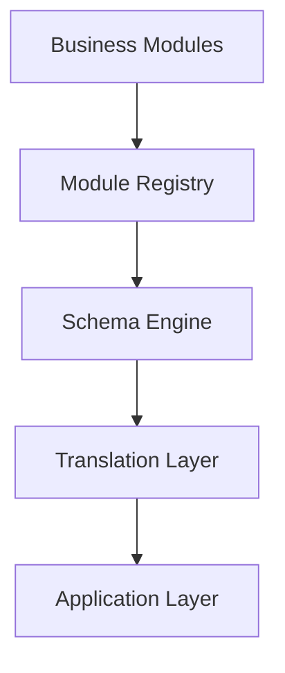

# Module Registry

## Overview

The Module Registry is responsible for discovering and managing all business modules within AJ-OS.

Rather than hardcoding synchronization targets throughout the application, every business capability is registered once and becomes automatically available to the rest of the system.

The Module Registry acts as the bridge between business modeling and the synchronization pipeline.

---

# Registry Flow

The following diagram illustrates how business modules enter the application.


Every business module follows the same registration process.

Once registered, it participates automatically in synchronization without requiring additional infrastructure changes.

---

# Responsibilities

The Module Registry is responsible for:

- Registering business modules
- Discovering available modules
- Providing modules to the application
- Maintaining a single source of registered capabilities
- Eliminating hardcoded synchronization logic

The registry contains no business logic.

Its responsibility is limited to managing the available modules.

---

# Why a Registry?

Without a registry, every new business module would require changes in multiple places throughout the application.

For example:

```text
Projects

↓

CRM

↓

Portfolio

↓

Finance

↓

Hardcoded Synchronization
```

As the application grows, this approach becomes difficult to maintain.

The Module Registry removes this dependency.

Instead, synchronization operates on the registered collection of modules rather than individual implementations.

---

# Registration Process

Adding a new business module follows a simple process.



Once registered, the module becomes available to:

- Workspace Synchronization
- Relation Resolution
- CEO Dashboard
- Future Business Rules

No additional infrastructure changes are required.

---

# Design Principles

## Single Registration

Every business module should be registered exactly once.

The registry becomes the authoritative list of available business capabilities.

---

## Separation of Concerns

The Module Registry does not:

- Define business schemas
- Synchronize databases
- Generate dashboards
- Apply business rules

Those responsibilities belong to other architectural layers.

---

## Extensibility

The registry allows AJ-OS to grow by adding modules rather than modifying infrastructure.

Future modules can be introduced without changing the synchronization pipeline.

---

## Predictability

Every synchronization begins with the same ordered collection of registered modules.

This ensures deterministic execution and simplifies testing.

---

# Relationship to Other Layers

The Module Registry connects business modules with the rest of the architecture.



It serves as the application's entry point for business definitions.

---

# Future Opportunities

The registry provides a natural extension point for future capabilities.

Potential enhancements include:

- Dynamic module loading
- Feature flags
- Optional modules
- Plugin architecture
- Third-party extensions

These features can be introduced without changing the responsibilities of existing modules.

---

# Summary

The Module Registry provides a centralized, maintainable way to manage business capabilities.

By replacing hardcoded synchronization targets with a single registration mechanism, AJ-OS becomes easier to extend, easier to test and easier to maintain.

Adding a new business module should require registering it once—and nothing more.
