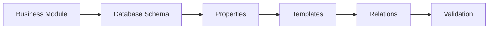
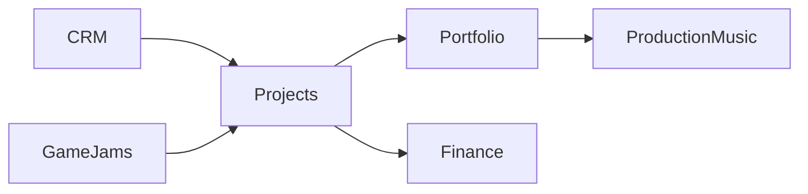
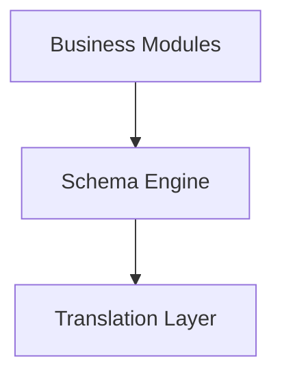

# Schema Engine

## Overview

The Schema Engine is the foundation of AJ-OS.

It provides a strongly typed representation of business concepts that is completely independent from any storage backend.

Business Modules use the Schema Engine to describe databases, properties, templates and relationships.

The Schema Engine does not know anything about Notion.

Its only responsibility is to model business information.

---

# Schema Flow

Every business definition follows the same lifecycle.



The resulting schema becomes the single source of truth for the rest of the application.

---

# Responsibilities

The Schema Engine is responsible for:

- Defining databases
- Defining properties
- Defining templates
- Defining relationships
- Validating business definitions

It is intentionally unaware of synchronization, translation and storage.

---

# Core Concepts

## Database

A database represents a business domain.

Examples include:

- Projects
- CRM
- Portfolio
- Production Music
- Finance
- Game Jams

Every business module exposes exactly one database definition.

---

## Properties

Properties describe the structure of a database.

Examples include:

- Title
- Status
- Priority
- Date
- Number
- Select
- Relation

Properties remain platform independent until translated.

---

## Templates

Templates provide predefined starting points for common business objects.

For example:

```
Project

↓

Game Project

Audio Prototype

Personal Project
```

Templates improve consistency while remaining fully customizable.

---

## Relations

Relations define how business domains connect.

Example:



Relations are declared within the schema and later synchronized automatically.

---

## Validation

Every schema is validated before synchronization.

Validation helps detect:

- Missing titles
- Invalid property definitions
- Unsupported configurations
- Broken relationships

Errors are reported before any changes are made to the workspace.

---

# Platform Independence

The Schema Engine intentionally avoids any dependency on the Notion SDK.

Instead, it produces an abstract business model.

Later architectural layers translate this model into backend-specific representations.

This separation keeps business logic reusable and testable.

---

# Design Principles

## Single Source of Truth

Business definitions exist only once.

Every other layer consumes the schema.

---

## Strong Typing

Every business definition is strongly typed.

Compile-time validation is preferred over runtime validation whenever possible.

---

## Declarative Design

The Schema Engine describes _what_ the business looks like.

It never describes _how_ that information is stored.

---

## Backend Agnostic

The Schema Engine should remain compatible with future storage backends.

No backend-specific concepts belong in this layer.

---

# Relationship to Other Layers

The Schema Engine sits between business modeling and infrastructure.



Business Modules create schemas.

The Translation Layer converts schemas into backend-specific payloads.

---

# Summary

The Schema Engine is the heart of AJ-OS.

It provides a strongly typed, platform-independent representation of the business that every other architectural layer depends upon.

By separating business modeling from infrastructure, the Schema Engine enables AJ-OS to remain maintainable, extensible and adaptable as new business capabilities and future backends are introduced.
