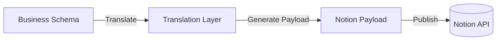
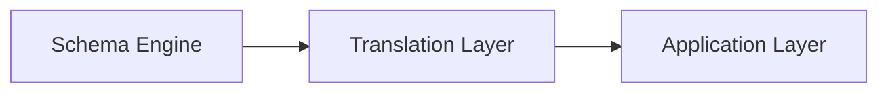

# Translation Layer

## Overview

The Translation Layer converts platform-independent business schemas into backend-specific representations.

Business Modules and the Schema Engine define **what** the business looks like.

The Translation Layer determines **how** those definitions are represented in a specific backend.

In the current implementation, the target backend is the Notion API.

---

# Translation Flow

The following diagram illustrates the translation process.



The Translation Layer transforms abstract business definitions into payloads understood by the target backend.

Business information itself remains unchanged.

---

# Responsibilities

The Translation Layer is responsible for:

- Translating database schemas
- Translating property definitions
- Translating relations
- Validating generated payloads
- Producing backend-compatible structures

The layer contains no business logic.

It simply converts one representation into another.

---

# Why a Translation Layer?

Without a Translation Layer, business modules would need to understand the Notion API directly.

This would tightly couple business logic to a single backend.

Instead, AJ-OS separates these concerns.

```text
Business Definition

↓

Translation Layer

↓

Backend Representation
```

This separation keeps the business model independent from infrastructure.

---

# Property Translation

Each property type has a corresponding translator.

Examples include:

- Title
- Rich Text
- Select
- Multi-select
- Number
- Date
- Checkbox
- URL
- Email
- Relation

Adding support for a new property type should only require implementing a new translator.

Existing business modules remain unchanged.

---

# Validation

Before payloads are published, they are validated.

Validation ensures:

- Supported property types
- Valid payload structure
- Required fields are present
- Unsupported configurations are rejected

Errors are detected before synchronization begins.

---

# Design Principles

## Backend Independence

Business Modules should never depend on backend-specific APIs.

Only the Translation Layer understands backend implementation details.

---

## Single Responsibility

The Translation Layer translates.

It does not:

- Define business schemas
- Synchronize workspaces
- Generate dashboards
- Apply business rules

---

## Extensibility

Supporting additional backends should require implementing new translators rather than modifying business modules.

Examples could include:

- SQL databases
- Local storage
- REST APIs
- Web applications

---

## Consistency

Every business schema is translated using the same process.

This ensures predictable synchronization and simplifies testing.

---

# Relationship to Other Layers

The Translation Layer sits between business modeling and execution.



The Schema Engine produces abstract business definitions.

The Translation Layer converts them into backend-compatible payloads.

The Application Layer executes the synchronization.

---

# Future Opportunities

The current implementation targets the Notion API.

The architecture allows additional translators to be introduced without changing business modules.

Potential future targets include:

- PostgreSQL
- SQLite
- JSON
- REST APIs
- Custom web applications

The Translation Layer provides the flexibility needed to support multiple execution environments while preserving a single business model.

---

# Summary

The Translation Layer isolates infrastructure concerns from business modeling.

By converting platform-independent schemas into backend-specific payloads, it enables AJ-OS to remain extensible, maintainable and independent of any single execution target.
