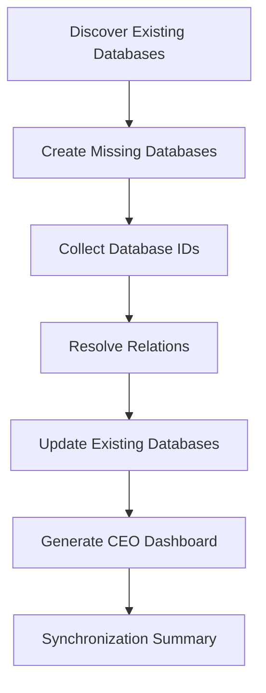

# Workspace Synchronization

## Overview

Workspace Synchronization is responsible for transforming business modules into a fully synchronized Notion workspace.

Rather than recreating the workspace on every run, AJ-OS performs an idempotent synchronization process that discovers existing resources, creates missing ones, updates relationships, and regenerates the CEO Dashboard.

This allows synchronization to be run safely at any time.

---

# Synchronization Flow

The following diagram illustrates the complete synchronization pipeline.



Every synchronization follows this exact sequence.

Each step completes before the next begins, ensuring the workspace remains in a consistent state.

---

# Synchronization Stages

## 1. Discover Existing Databases

AJ-OS scans the target Notion workspace and identifies databases that already exist.

This prevents duplicate databases from being created.

---

## 2. Create Missing Databases

Any registered business module without a corresponding Notion database is created automatically.

Existing databases are left unchanged.

---

## 3. Collect Database IDs

After all required databases exist, AJ-OS collects their identifiers.

These identifiers are required for creating relationships between databases.

---

## 4. Resolve Relations

AJ-OS compares the desired relationships defined by the business modules with the current workspace.

Missing relations are created automatically.

Existing relations are preserved.

---

## 5. Update Existing Databases

Existing databases are synchronized with the latest schema definitions.

Only necessary changes are applied.

This keeps synchronization safe and predictable.

---

## 6. Generate CEO Dashboard

Once the workspace has been synchronized, AJ-OS generates the CEO Dashboard.

The Dashboard summarizes business information instead of duplicating database views.

It is regenerated every time synchronization runs.

---

## 7. Synchronization Summary

Finally, AJ-OS produces a summary of the synchronization process.

Typical information includes:

- Databases created
- Databases skipped
- Relations created
- Relations skipped
- Dashboard generation status

This provides immediate feedback after every synchronization.

---

# Idempotency

Workspace Synchronization is intentionally idempotent.

Running synchronization multiple times always produces the same workspace.

For example:

```
Run #1

Create databases
Create relations
Generate dashboard

↓

Run #2

Skip databases
Skip relations
Regenerate dashboard

↓

Workspace remains unchanged
```

This makes synchronization safe to execute repeatedly during development or daily business use.

---

# Error Handling

Synchronization is designed to fail safely.

If an operation cannot be completed:

- previously synchronized databases remain intact
- existing relationships are preserved
- completed steps are not repeated unnecessarily

The synchronization summary reports any failures for review.

---

# Design Principles

Workspace Synchronization follows four principles:

- **Deterministic** — the same input always produces the same result.
- **Idempotent** — repeated runs never create duplicates.
- **Incremental** — only required changes are applied.
- **Observable** — every synchronization produces a clear summary.

---

# Summary

Workspace Synchronization is the execution engine of AJ-OS.

It transforms business definitions into a fully connected Notion workspace while maintaining consistency, repeatability and safety across every synchronization run.
