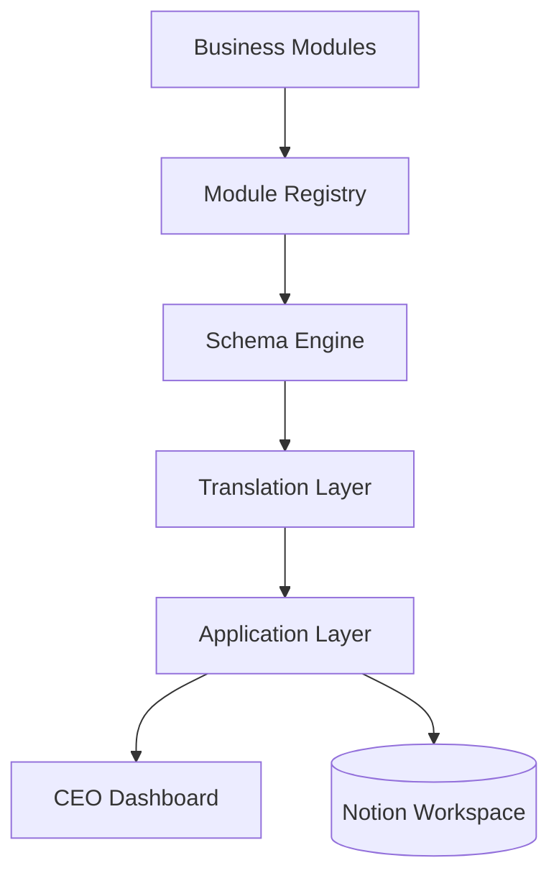

# Architecture

> **Archived (AJ-OS v1).** Superseded technical documentation — it describes an
> earlier generation, not AJ-OS today. See [`docs/archive/v1/`](../README.md)
> and [`docs/VISION.md`](../../../VISION.md).

AJ-OS is built around a layered, code-first architecture.

Rather than treating Notion as the source of truth, AJ-OS models the business in TypeScript and synchronizes that model into a Notion workspace.

Each layer has a single responsibility.

This separation keeps business logic independent from infrastructure while allowing the system to evolve without architectural redesign.

---

# Architecture Overview

The following diagram illustrates the complete flow of information through AJ-OS.

Business information flows through the architecture from left to right.

Business Modules describe the business.

The remaining layers transform those definitions into a synchronized Notion workspace and an automatically generated executive dashboard.

No business layer depends directly on the Notion SDK.

---

# Layers

## Business Modules

Business Modules describe business capabilities.

Current modules include:

- Projects
- CRM
- Portfolio
- Production Music
- Finance
- Game Jams

Business Modules contain business definitions only.

They do not know how information is stored or synchronized.

---

## Module Registry

The Module Registry discovers and validates business modules.

Its responsibilities include:

- Module registration
- Module discovery
- Centralized access
- Synchronization ordering

Adding a new module should only require registering it.

Infrastructure should remain unchanged.

---

## Schema Engine

The Schema Engine provides the strongly typed business language used throughout AJ-OS.

It defines:

- Databases
- Properties
- Templates
- Relations
- Validation

The Schema Engine remains completely platform independent.

---

## Translation Layer

The Translation Layer converts business schemas into backend-compatible payloads.

Responsibilities include:

- Property translation
- Database translation
- Validation
- Backend compatibility

No business logic belongs here.

---

## Application Layer

The Application Layer orchestrates synchronization.

Responsibilities include:

- Workspace synchronization
- Database creation
- Relation synchronization
- Dashboard generation

The Application Layer coordinates the workflow but does not define business rules.

---

## CEO Dashboard

The CEO Dashboard is the primary entry point into AJ-OS.

Rather than exposing raw database views, it summarizes business information into an executive overview.

The Dashboard answers one question:

> **What does my business need from me today?**

---

## Notion Workspace

Notion is the first supported backend.

AJ-OS treats Notion as an execution target rather than the source of truth.

Future backends can be introduced without changing business modules.

---

# Design Principles

AJ-OS follows several architectural principles.

## Code First

Business logic is defined in TypeScript.

Generated Notion databases are outputs rather than the source of truth.

---

## Separation of Concerns

Each architectural layer has exactly one responsibility.

Responsibilities never overlap.

---

## Strong Typing

Business definitions are strongly typed.

This improves maintainability and reduces runtime errors.

---

## Platform Independence

Business logic remains independent from any specific backend.

Notion is currently the first supported backend.

---

## Idempotency

Synchronization is deterministic.

Running synchronization repeatedly always produces the same business state.

---

# Reading Order

For developers new to AJ-OS, the recommended reading order is:

1. Schema Engine
2. Module Registry
3. Translation Layer
4. Application Layer
5. Workspace Synchronization
6. CEO Dashboard
7. Business Rules

Following this order provides a gradual understanding of the system from business modeling to workspace generation.

---

# Summary

AJ-OS models a business independently of its execution environment.

Business Modules describe the business.

The architecture transforms those definitions into a synchronized workspace and an executive dashboard.

This separation enables AJ-OS to remain maintainable, extensible and adaptable as new business capabilities are introduced.
